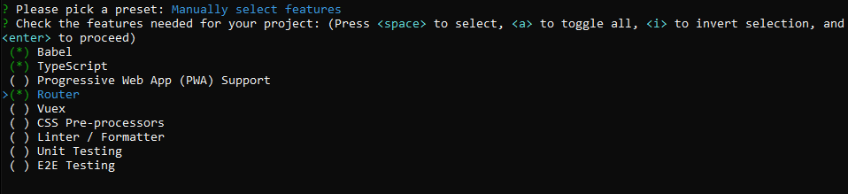

## Star Wars Project

`♻️ | VUE Project Star Wars Movies`

`♻️ (Update) : Star Wars Project`

<b>♻️ Primeiros Passos: Criação</b>

* `vue create <nome do projeto>` (criando o projeto)

* `npm install -D sass-loader node-sass` (instalando o loader do SASS)

* **Configuração:**

    * `Manually select features`

 

<b>♻️ Star Wars: Desenvolvimento</b>

* **API:**
    * [PipDream](https://pipedream.com/apps/swapi)
    * [Django Framework](https://swapi.dev/api/films/)

